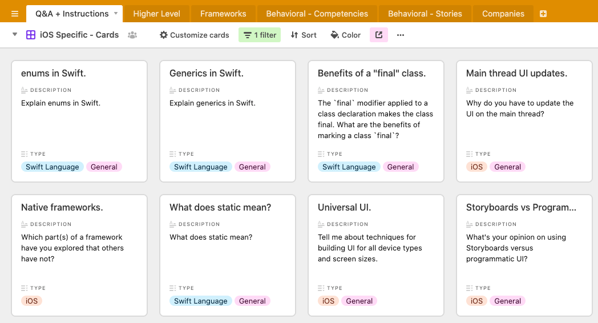

iOS Questions
================================== 

These are all the iOS Specific questions we've gathered from the iOS community. Some have comments as to why the question is asked, or hints for the answer. Enjoy! And if you want a question included here, please submit a PR!

You can browse through these with in our <a href="https://airtable.com/shrTixYZjswKMzU6d" target="_blank">iOS Interview Airtable Workspace</a>!

### iOS Specific

Explain different kinds of dependency injection.

Explain enums in Swift.
Explain generics in Swift.

> Shows a strong knowledge of the swift language and most industry code bases leverage these.

The `final` modifier applied to a class declaration makes the class final. 

> What are the benefits of marking a class `final`? A non-final class
> can be subclassed, and its methods can be overridden. So given a
> method of a class, that method can have different implementations in
> any of the subclasses. When a method is invoked, the runtime must
> figure out which override to call, and, as such, method invocation is
> resolved dynamically, at runtime, using a vtable. If a class is
> declared final, it cannot be subclassed, and, as such, its methods
> cannot be overridden. This means that method invocations can be
> resolved statically, at compilation time. So invoking a method on a
> final class is much faster than on a non-final, subclassable class.

Is a closure a value or a reference type?

Explain the difference between classes and structs.

> I like this question because most people know at least a surface-level
> answer, but depending on their knowledge and ability to explain things
> they can get much more in-depth. In that sense, it's a good question
> to quickly judge where someone is at, whether they know things because
> they truly understand the inner workings, or are repeating things
> they've read online.

What does static mean?

Why do you like swift and what advantages or disadvantages does it have over other languages?

What is the difference between weak and unowned and when we should use which?

What is the concept of an abstract class in Swift?

Do you prefer Objective C or Swift? Why?

Which part(s) of a framework have you explored that others have not?

When would you use unowned VS weak self in a closure?

> https://stackoverflow.com/questions/24320347/shall-we-always-use-unowned-self-inside-closure-in-swift

What is Core Data?

How many possible states can a UIKit app be in and what are they?

Why do you have to update the UI on the main thread?

> It shows how deep the developer goes to discover the "why" of the
> things, and he/she doesn't only read answers on StackOverflow.

Tell me about techniques for building UI for all device types and screen sizes. 

> I can find out what the interviewee knows about Storyboards, traits
> and constraints-in-code and their relative advantages and pitfalls.I
> can find out what the interviewee knows about Storyboards, traits and
> constraints-in-code and their relative advantages and pitfalls.

What's your opinion on using Storyboards versus programmatic UI?

What's Autolayout?

What are memory leaks and how we should avoid them?

> 1) Talking a little bit about ARC and how it works.
> 
> 2) Stating the 3 main reasons for causing memory leaks which are: a)
> Strong relationship between 2 classes referencing each others b)
> Strong relationship between a protocol and a class (example in
> delegation pattern) c) Strong self inside a closure in a class.

3) To avoid them we should use weak or unowned in those cases."

How would you describe how an iOS application works to a five year old?

Explain ARC to a five year old.

How can you persist data in iOS?

What happen when I set the target of a UIControl to nil?

Tell me about NSPredicate.

What's the difference between nonatomic, atomic and copy?

What's the difference between strong, weak and unowned? 

> The difference between unowned and weak is that weak is declared as an Optional while unowned is not. By declaring it weak you get to handle the case that it might be nil inside the closure at some point. If you try to access an unowned variable that happens to be nil, it will crash the whole program. So only use unowned when you are positive that variable will always be around while the closure is around.
> 
> An example for unowned is that a credit card will always be associated
> with a customer.
> 
> https://developer.apple.com/library/content/documentation/Swift/Conceptual/Swift_Programming_Language/AutomaticReferenceCounting.html

What is ARC?

> Weak references don't  count in the reference count of an object.
> Unowned references also don't increase the object's reference count.
> Unowned reference have to have a value, but weak ones can be nil.

What are closures?

> https://docs.swift.org/swift-book/LanguageGuide/Closures.html

What is delegation and how does it work?

> http://www.andrewcbancroft.com/2015/03/26/what-is-delegation-a-swift-developers-guide/
> 
> https://www.andrewcbancroft.com/2015/04/08/how-delegation-works-a-swift-developer-guide/
> 
> It’s also worth noting the scope of the communication that delegation
> is intended to be used for. Whereas NSNotificationCenter fits the need
> for one instance to broadcast a message intended for more than one
> listening instance, delegation fits the scenario where an instance
> only needs to send a message to a single listener (the delegate).

Describe the iOS application 

> https://developer.apple.com/documentation/uikit

What is protocol oriented programming and what are the pros/cons of using it over OOP?

Can you explain the responder chain?

Blocks or NSOperation?

Explain memory management in iOS. is it compile time or run time?

> Gives insight about the retain cycles, leaks and memory management.

Explain the different ways of passing data in iOS.

What are singletons and what's a good use case for them in iOS applications?

Are arrays value types or reference types in swift?

What's the different between atomic and nonatomic?

## Any Questions
If you have any questions, comments or concerns, open a Github Issue on this repository.
